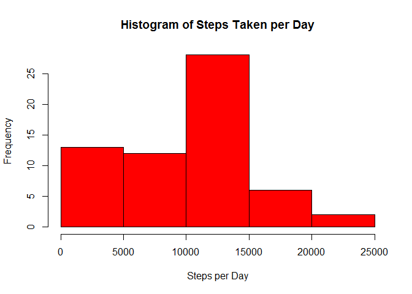
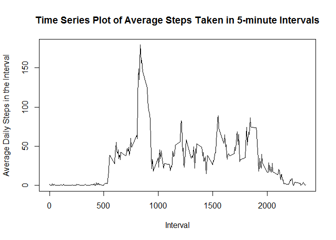
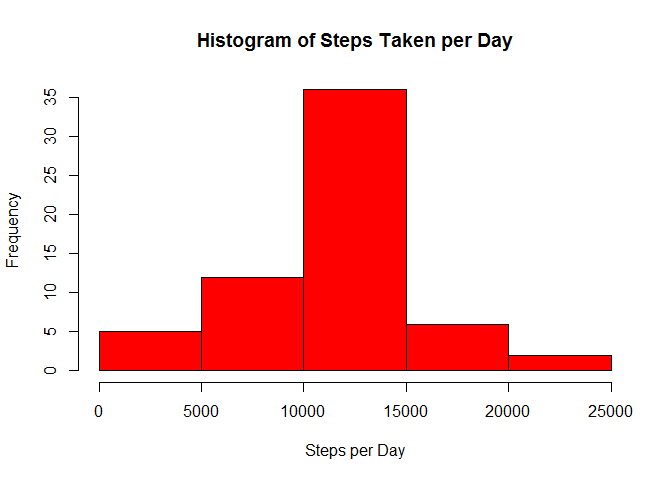
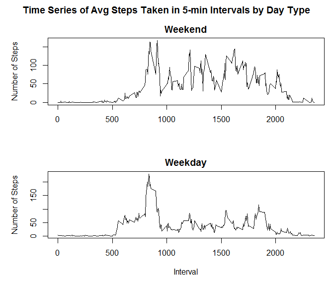

# Reproducible Research: Peer Assessment 1


## Loading and preprocessing the data

```r
#hide package load messages, display chunk results at the end
library("knitr")
opts_chunk$set(warning=F,message=F,results="hold",cache=T)

actdata<-read.csv("activity.csv")
# interval data is in "microwave time" (ex: 105=1 hour 5 mins)
#   unit and tens digits are minutes, hundreds and thousands digits are hours
# we're going to convert data+interval into DateTime
hrs<-actdata$interval%/%100
mins<-actdata$interval%%100
require(stringr)
hrs<-str_sub(paste("0",as.character(hrs),sep=""),start=-2) #force leading 0
mins<-str_sub(paste("0",as.character(mins),sep=""),start=-2) #force leading 0
times<-paste(hrs,mins,"00",sep=":")
actdata$DateTime<-strptime(paste(actdata$date,times,sep=" "),format="%Y-%m-%d %H:%M:%S")
str(actdata)
```

```
## 'data.frame':	17568 obs. of  4 variables:
##  $ steps   : int  NA NA NA NA NA NA NA NA NA NA ...
##  $ date    : Factor w/ 61 levels "2012-10-01","2012-10-02",..: 1 1 1 1 1 1 1 1 1 1 ...
##  $ interval: int  0 5 10 15 20 25 30 35 40 45 ...
##  $ DateTime: POSIXlt, format: "2012-10-01 00:00:00" "2012-10-01 00:05:00" ...
```

Summary of steps:


```r
summary(actdata$steps)
```

```
##    Min. 1st Qu.  Median    Mean 3rd Qu.    Max.    NA's 
##    0.00    0.00    0.00   37.38   12.00  806.00    2304
```


## What is mean total number of steps taken per day?

We're going to ignore days during which we have no data (in particular, day 1)


```r
#add up steps per day
actdata.nona<-na.omit(actdata)
dates<-levels(actdata.nona$date)
stepsum<-rep(0,length(dates))

for (i in 1:length(dates)) {
    selectVect<-as.character(actdata.nona$date)==dates[i] #logical match vector
    stepsum[i]<-sum(actdata.nona[selectVect,c("steps")])
}

actdata.sum<-data.frame(date=as.Date(dates),steps=stepsum)

#get aggregates and plot
actdata.sum.mean<-mean(actdata.sum$steps)
actdata.sum.median<-median(actdata.sum$steps)
hist(actdata.sum$steps,col="red",xlab="Steps per Day",ylab="Frequency",main="Histogram of Steps Taken per Day")
```

 

The mean steps taken per day is 9354.23.

The median steps taken per day is 10395.


## What is the average daily activity pattern?

The goal of this section is to analyze the average steps taken by time of day


```r
#add up steps per time interval
intervals<-as.integer(levels(as.factor(actdata.nona$interval)))
stepsavg<-rep(0,length(intervals))

for (i in 1:length(intervals)) {
    selectVect<-actdata.nona$interval==intervals[i] #logical match vector
    # using length(dates) instead of mean to account for days missing data in that interval
    #  because we're asked to average across all days
    stepsavg[i]<-sum(actdata.nona[selectVect,c("steps")])/length(dates)
}

actdata.avg<-data.frame(interval=intervals,stepsavg=stepsavg)

#store the max steps interval
actdata.avg.maxsteps<-max(actdata.avg$stepsavg)
actdata.avg.maxint<-actdata.avg[actdata.avg$stepsavg==actdata.avg.maxsteps,c("interval")]
#create the time series plot
plot(actdata.avg$interval,actdata.avg$stepsavg,type="l",
     xlab="Interval",ylab="Average Daily Steps in the Interval",main="Time Series Plot of Average Steps Taken in 5-minute Intervals")
```

 

The maximum average steps taken in a 5-minute interval was 179.13. This occurred in interval 835, which corresponds to 8 hours and 35 minutes.


## Imputing missing values

```r
countna<-length(actdata$steps)-length(actdata.nona$steps) #total NAs
```

We have 2304 intervals with no data (NA values). We're going to assume the expected number of steps in each interval doesn't change across days. This will allow us to augment the missing data with interval means computed from our previous data. This interval average will be slightly different than the previous calculation, since we'll be taking the mean of available data for each interval, not the mean across all days.


```r
#add up steps per time interval
intervals<-as.integer(levels(as.factor(actdata$interval)))
stepsavg<-rep(0,length(intervals))

for (i in 1:length(intervals)) {
    selectVect<-actdata.nona$interval==intervals[i] #logical match vector
    # We want the mean for each interval, using only available data
    stepsavg[i]<-mean(actdata.nona[selectVect,c("steps")])
}

actdata.avg.perint<-data.frame(interval=intervals,stepsavg=stepsavg)

actdata.aug<-actdata #new df to store our augmented data
for (i in 1:length(actdata.aug$step)) {
    if (is.na(actdata.aug[i,c("steps")])) { #if steps are NA, fill with the interval mean
        actdata.aug[i,c("steps")]<-subset(actdata.avg.perint,interval==actdata.aug[i,c("interval")])$stepsavg
    }
}

#add up steps per day
dates<-levels(actdata.aug$date)
stepsum<-rep(0,length(dates))

for (i in 1:length(dates)) {
    selectVect<-as.character(actdata.aug$date)==dates[i] #logical match vector
    stepsum[i]<-sum(actdata.aug[selectVect,c("steps")])
}

actdata.aug.sum<-data.frame(date=as.Date(dates),steps=stepsum)

#get aggregates and plot
actdata.aug.sum.mean<-mean(actdata.aug.sum$steps)
actdata.aug.sum.median<-median(actdata.aug.sum$steps)
hist(actdata.aug.sum$steps,col="red",xlab="Steps per Day",ylab="Frequency",main="Histogram of Steps Taken per Day")
```

 

The augmented mean steps taken per day is 10766.19, which is an increase of 1411.96 from our data without NAs.

The augmented median steps taken per day is 10766.19, which is an increase of 371.19 from our data without NAs.

It's surprising that the mean and median match exactly, but it's true.


## Are there differences in activity patterns between weekdays and weekends?

```r
#Categorize each day as weekday/weekend
daytype<-weekdays(as.Date(actdata.aug$date))
daytype[is.element(daytype,c("Monday","Tuesday","Wednesday","Thursday","Friday"))]<-"weekday"
daytype[is.element(daytype,c("Saturday","Sunday"))]<-"weekend"
actdata.aug$daytype<-as.factor(daytype)

#add up steps per time interval
intervals<-as.integer(levels(as.factor(actdata.aug$interval)))
stepsavg.weekday<-rep(0,length(intervals))
stepsavg.weekend<-rep(0,length(intervals))

for (i in 1:length(intervals)) {
    #get weekday mean
    selectVect<-actdata.aug$interval==intervals[i] & actdata.aug$daytype=="weekday" #logical match vector
    # everything has data, so we can just use the mean function
    stepsavg.weekday[i]<-mean(actdata.aug[selectVect,c("steps")])
    
    #get weekend mean
    selectVect<-actdata.aug$interval==intervals[i] & actdata.aug$daytype=="weekend" #logical match vector
    # everything has data, so we can just use the mean function
    stepsavg.weekend[i]<-mean(actdata.aug[selectVect,c("steps")])
}

actdata.avg<-data.frame(interval=intervals,stepsavg.weekday=stepsavg.weekday,stepsavg.weekend=stepsavg.weekend)

#get means for each day type (sum of the average intervals)
actdata.avg.weekend<-sum(actdata.avg$stepsavg.weekend)
actdata.avg.weekday<-sum(actdata.avg$stepsavg.weekday)

#create the time series panels
par(mfcol=c(2,1),mar=c(5,5,2,1),oma=c(0,0,2,0))
plot(actdata.avg$interval,actdata.avg$stepsavg.weekend,type="l", xlab="",ylab="Number of Steps",main="Weekend")
plot(actdata.avg$interval,actdata.avg$stepsavg.weekday,type="l", xlab="Interval",ylab="Number of Steps",main="Weekday")
title(main="Time Series of Avg Steps Taken in 5-min Intervals by Day Type",outer=T)
```

 

The average steps taken per day on a weekend is 12201.52.

The average steps taken per day on a weekday is 10255.85.

This person was quite a bit more active during the weekends.
